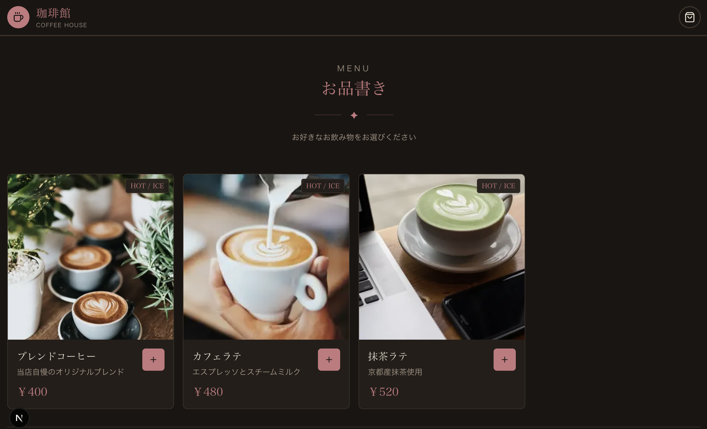
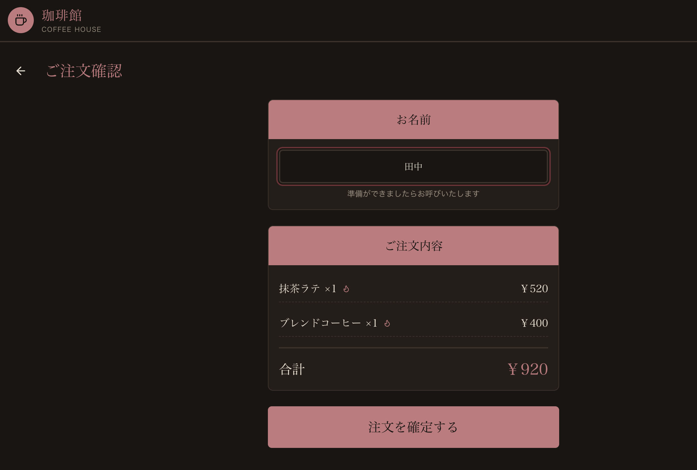
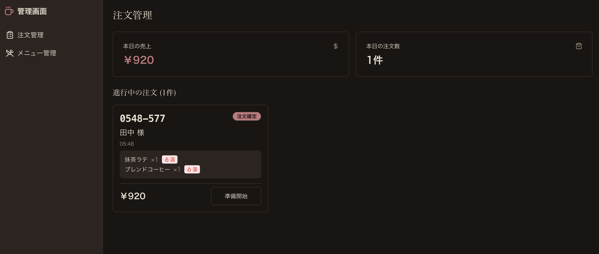

<div align="center">

# ☕ Cafe Order System

**モダンなカフェ向けセルフオーダーシステム**

*A modern self-ordering system for cafes*

<br>

[](https://nextjs.org/)
[](https://www.typescriptlang.org/)
[](https://supabase.com/)
[](https://tailwindcss.com/)
[](https://stripe.com/)

<br>



</div>

---

## Overview | 概要

カフェ向けの**モバイルファースト・セルフオーダーシステム**です。

お客様はスマートフォンからQRコードを読み取り、メニューの閲覧から注文・決済までをスムーズに完了できます。店舗スタッフは管理画面でリアルタイムに注文を確認し、効率的なオペレーションを実現します。

<div align="center">



*注文から受け取りまでシームレスな体験*

</div>

---

## Features | 機能

<table>
<tr>
<td width="50%">

### 📱 お客様向け機能
- **メニュー閲覧**: 写真付きの見やすいメニュー
- **カート機能**: 商品の追加・削除・数量変更
- **温度選択**: ホット/アイスの選択対応
- **オンライン決済**: Stripe連携
- **注文追跡**: リアルタイムでステータス確認

</td>
<td width="50%">

### 🖥️ 管理者向け機能
- **注文管理**: リアルタイム注文一覧
- **ステータス更新**: 調理中→完了の管理
- **メニュー管理**: 商品のCRUD操作
- **売上サマリー**: 日次売上・注文数表示
- **在庫管理**: 売り切れ設定

</td>
</tr>
</table>

<div align="center">



*管理画面で注文をリアルタイム管理*

</div>

---

## Tech Stack | 技術スタック

| Category | Technology |
|----------|------------|
| **Framework** | Next.js 15 (App Router) |
| **Language** | TypeScript |
| **Styling** | Tailwind CSS, shadcn/ui |
| **Database** | Supabase (PostgreSQL) |
| **Authentication** | Supabase Auth |
| **Payment** | Stripe |
| **Notification** | LINE Messaging API, Resend |
| **Deployment** | Vercel |

---

## Architecture | アーキテクチャ

```
┌─────────────────┐     ┌─────────────────┐
│   Customer App  │     │   Admin Panel   │
│   (Mobile Web)  │     │   (Desktop)     │
└────────┬────────┘     └────────┬────────┘
         │                       │
         └───────────┬───────────┘
                     │
              ┌──────▼──────┐
              │  Next.js    │
              │  API Routes │
              └──────┬──────┘
                     │
         ┌───────────┼───────────┐
         │           │           │
   ┌─────▼─────┐ ┌───▼───┐ ┌────▼────┐
   │ Supabase  │ │Stripe │ │  LINE   │
   │ Database  │ │Payment│ │  Notify │
   └───────────┘ └───────┘ └─────────┘
```

---

## Development Process | 開発プロセス

<div align="center">

### 🤖 AI-Powered Development

</div>

本プロジェクトは、**AIエージェント（Claude Code）を開発パートナーとして活用**し、設計から実装までを迅速かつ高品質に実現しました。

- **要件定義**: 自然言語での対話を通じてシステム仕様を策定
- **フルスタック実装**: フロントエンド・バックエンド・決済連携まで一貫して開発
- **UI/UXデザイン**: モバイルファーストの直感的なインターフェース設計
- **リアルタイム機能**: Supabaseを活用したリアルタイム注文更新

> AIとの協業により、従来数週間かかる開発を大幅に短縮し、高い生産性と品質を両立しました。

---

## Screenshots | スクリーンショット

<details>
<summary>クリックで展開</summary>

### メニュー画面


### カート画面


### 注文確認画面


### 管理画面


</details>

---

## Getting Started | セットアップ

### Prerequisites | 前提条件

- Node.js 18+
- Supabase アカウント
- Stripe アカウント（決済機能を使用する場合）

### Installation | インストール

```bash
# Clone the repository
git clone https://github.com/morimori963/cafe-order-system.git
cd cafe-order-system

# Install dependencies
npm install

# Setup environment variables
cp .env.example .env.local
# Edit .env.local with your Supabase and Stripe keys

# Start development server
npm run dev
```

### Environment Variables | 環境変数

```env
# Supabase
NEXT_PUBLIC_SUPABASE_URL=your_supabase_url
NEXT_PUBLIC_SUPABASE_ANON_KEY=your_anon_key
SUPABASE_SERVICE_ROLE_KEY=your_service_role_key

# Stripe
STRIPE_SECRET_KEY=your_stripe_secret
STRIPE_WEBHOOK_SECRET=your_webhook_secret
NEXT_PUBLIC_STRIPE_PUBLISHABLE_KEY=your_stripe_publishable

# LINE Messaging API
LINE_CHANNEL_ACCESS_TOKEN=your_line_token
LINE_CHANNEL_SECRET=your_line_secret

# Email (Resend)
RESEND_API_KEY=your_resend_key

# App
NEXT_PUBLIC_APP_URL=http://localhost:3000
```

### Access | アクセス

| Page | URL |
|------|-----|
| Customer Menu | http://localhost:3000 |
| Admin Dashboard | http://localhost:3000/admin |
| Menu Management | http://localhost:3000/admin/menu |

---

## Project Structure | プロジェクト構成

```
cafe-order-system/
├── src/
│   ├── app/
│   │   ├── (customer)/      # Customer pages
│   │   │   ├── cart/        # Shopping cart
│   │   │   ├── checkout/    # Checkout flow
│   │   │   └── orders/      # Order tracking
│   │   ├── (admin)/         # Admin pages
│   │   │   └── admin/       # Dashboard & menu management
│   │   └── api/             # API routes
│   │       ├── checkout/    # Stripe checkout
│   │       ├── orders/      # Order management
│   │       └── webhook/     # Stripe webhooks
│   ├── components/          # React components
│   │   ├── ui/              # shadcn/ui components
│   │   └── admin/           # Admin-specific components
│   ├── lib/                 # Utilities & configs
│   └── types/               # TypeScript types
├── public/                  # Static assets
├── supabase/               # Database migrations
└── docs/screenshots/       # README images
```

---

## Database Schema | データベース

```sql
-- Menu Items
menu_items (id, name, description, price, image_url, has_temperature, is_available, sort_order)

-- Orders
orders (id, order_number, customer_name, total_amount, status, created_at)

-- Order Items
order_items (id, order_id, menu_item_id, quantity, temperature, price)
```

---

## License | ライセンス

MIT License

---

<div align="center">

**Built with ☕ and 🤖**

*AI-Powered Cafe Solution*

</div>
